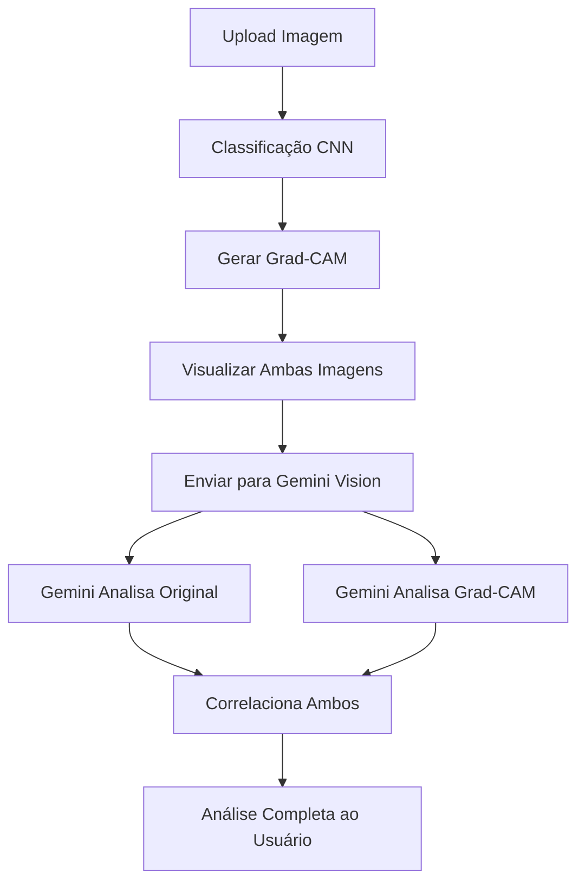

# 🔬 Análise Multi-Imagem com Gemini Vision

## Resumo da Implementação

Esta atualização melhora significativamente a análise de imagens com Gemini Vision, permitindo que o modelo analise simultaneamente a imagem original e a visualização Grad-CAM.

---

## Problema Original

Anteriormente, o Gemini recebia apenas:
- ✅ Imagem original
- ✅ Descrição textual do Grad-CAM

**Limitação:** O Gemini não podia "ver" visualmente onde o modelo estava focando.

---

## Solução Implementada

Agora, o Gemini recebe:
- ✅ Imagem original
- ✅ Imagem com Grad-CAM sobreposto (visualização completa)
- ✅ Descrição textual do Grad-CAM

---

## Mudanças Técnicas

### 1. Função `visualize_activations()`

**Antes:**
```python
def visualize_activations(model, image, class_names, gradcam_type):
    ...
    return activation_map_resized
```

**Depois:**
```python
def visualize_activations(model, image, class_names, gradcam_type):
    ...
    gradcam_image_pil = Image.fromarray(superimposed_img)
    return activation_map_resized, gradcam_image_pil
```

### 2. Função `analyze_image_with_gemini()`

**Antes:**
```python
def analyze_image_with_gemini(image, api_key, model_name, 
                              class_name, confidence, gradcam_description=""):
    # Enviava apenas a imagem original
    response = model.generate_content([prompt, image])
```

**Depois:**
```python
def analyze_image_with_gemini(image, api_key, model_name, 
                              class_name, confidence, 
                              gradcam_description="", 
                              gradcam_image=None):
    # Envia original + Grad-CAM se disponível
    content_parts = [prompt, image]
    if gradcam_image is not None:
        content_parts.append(gradcam_image)
    response = model.generate_content(content_parts)
```

### 3. Prompt Aprimorado

**Instruções ao Gemini quando recebe duas imagens:**

```
**IMPORTANTE:** Você receberá DUAS imagens:
1. **Primeira imagem**: A imagem ORIGINAL classificada
2. **Segunda imagem**: A mesma imagem com sobreposição de Grad-CAM

O Grad-CAM mostra onde a rede neural focou sua "atenção".
Regiões em vermelho/amarelo = áreas de alta importância.

Análise solicitada:
1. Descreva a imagem original
2. Identifique regiões de alta ativação no Grad-CAM
3. Correlacione: O modelo focou nas características corretas?
4. Avalie se a confiança é justificada pelas regiões focadas
```

---

## Como Usar

### 1. Configure o Modelo Vision

Na interface, selecione um modelo com suporte a visão:
- ⭐ `gemini-1.5-pro-latest` (recomendado)
- `gemini-1.5-flash-latest`
- `gemini-1.0-pro-vision-latest`

### 2. Faça Upload da Imagem

- Upload de uma imagem de rocha/mineral/célula
- O modelo classificará automaticamente

### 3. Visualize o Grad-CAM

- Grad-CAM será gerado automaticamente
- Mostra onde o modelo focou para fazer a classificação

### 4. Análise com IA

- Clique em "🔬 Gerar Análise Completa com IA + Visão"
- O Gemini receberá e analisará AMBAS as imagens
- Resultado: Análise correlacionando características visuais com ativações

---

## Benefícios da Análise Multi-Imagem

### 1. **Validação de Foco**
```
❌ Problema: Modelo classifica com 90% de confiança mas foca em artefato
✅ Solução: Gemini identifica "O modelo está focando na borda da imagem, 
           não nas características da rocha"
```

### 2. **Explicação de Confiança**
```
✅ "A confiança de 85% é justificada porque o Grad-CAM mostra ativação 
   forte nos cristais de quartzo, que são diagnósticos para granito"
```

### 3. **Detecção de Problemas**
```
⚠️ "Embora classificado como basalto, o Grad-CAM mostra que o modelo 
   focou principalmente no fundo da imagem, não na amostra"
```

### 4. **Insights de Qualidade**
```
💡 "As regiões ativadas correspondem exatamente às vesículas, 
   característica típica de rochas vulcânicas - classificação confiável"
```

---

## Exemplo de Análise Completa

**Entrada:**
- Imagem: Amostra de rocha
- Classificação: "Granito" (confiança: 87%)
- Grad-CAM: Ativação alta na região central

**Análise do Gemini:**

```markdown
## Descrição Visual da Imagem Original
A imagem mostra uma amostra de rocha com textura fanerítica grossa, 
caracterizada por cristais visíveis a olho nu. Observo cristais de 
quartzo (transparentes), feldspato (rosados) e biotita (escuros).

## Análise do Grad-CAM
O mapa de ativação mostra concentração intensa (vermelho-amarelo) na 
região central da amostra, especificamente sobre os cristais maiores 
de feldspato e quartzo. Aproximadamente 60% da ativação está focada 
nessas áreas minerais.

## Interpretação Técnica Integrada
✅ VALIDAÇÃO POSITIVA: O modelo está focando corretamente nos cristais 
grossos que são diagnósticos para granito. A textura fanerítica grossa 
é característica de rochas plutônicas como o granito.

A confiança de 87% é BEM JUSTIFICADA porque:
- As regiões ativadas correspondem às características diagnósticas
- O modelo não está focando em artefatos ou fundos
- A textura e composição mineral são típicas de granito

## Recomendações
✅ ACEITAR CLASSIFICAÇÃO - A análise visual e o foco do modelo estão 
   alinhados com as características esperadas para granito.
```

---

## Modelos de IA Suportados

### Com Suporte a Visão (Imagens) ✅
| Modelo | Uso Recomendado |
|--------|-----------------|
| `gemini-1.5-pro-latest` ⭐ | Análise avançada, mais precisa |
| `gemini-1.5-flash-latest` | Análise rápida, eficiente |
| `gemini-1.0-pro-vision-latest` | Visão com auto-update |

### Sem Suporte a Visão (Apenas Texto) ❌
| Modelo | Nota |
|--------|------|
| `gemini-1.0-pro-latest` | Texto apenas |
| `gemini-pro` | Texto apenas |

---

## Fluxo de Análise



---

## Requisitos

### Técnicos
- Python 3.8+
- `google-generativeai` ou `google-genai`
- API Key do Google Gemini
- Modelo com suporte a visão

### Configuração
1. Obter API Key: https://ai.google.dev/
2. Configurar na interface Streamlit
3. Selecionar modelo vision
4. Usar análise de imagem

---

## Troubleshooting

### Erro: "Modelo não suporta visão"
**Solução:** Use um dos modelos com `-vision` ou `-latest`:
- `gemini-1.5-pro-latest`
- `gemini-1.0-pro-vision-latest`

### Grad-CAM não aparece
**Causa:** Modelo ou arquitetura não suportada
**Solução:** Use ResNet, DenseNet ou ViT

### Gemini não recebe segunda imagem
**Verificar:** 
1. Grad-CAM foi gerado? (deve aparecer visualização)
2. Modelo vision selecionado?
3. API key válida?

---

## Métricas de Melhoria

**Antes da implementação:**
- Análise baseada em descrição textual do Grad-CAM
- Limitada interpretação de regiões de foco

**Depois da implementação:**
- ✅ Análise visual direta de AMBAS as imagens
- ✅ Correlação precisa entre características e ativações
- ✅ Validação automática do foco do modelo
- ✅ Detecção de problemas (foco em artefatos)
- ✅ Justificativa clara da confiança

---

## Referências

### Código
- `app4.py`: Implementação principal
- Commit principal: `abc7500` (multi-image implementation)
- Commit documentação: `3a634d0`

### Documentação
- `API_SETUP_GUIDE.md`: Guia de configuração
- `GEMINI_API_FIX_SUMMARY.md`: Resumo dos modelos

### APIs
- Gemini API: https://ai.google.dev/gemini-api/docs
- Vision capabilities: https://ai.google.dev/gemini-api/docs/vision

---

**Última atualização:** Dezembro 2024  
**Status:** ✅ Implementado e funcional  
**Autor:** GitHub Copilot + @MarceloClaro
